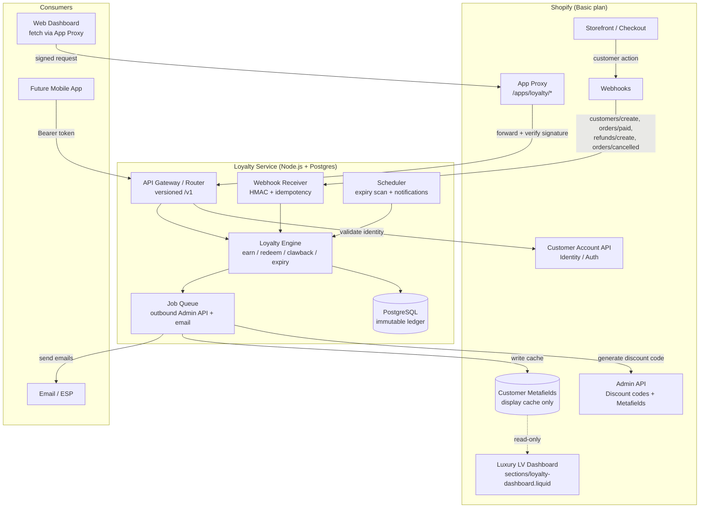
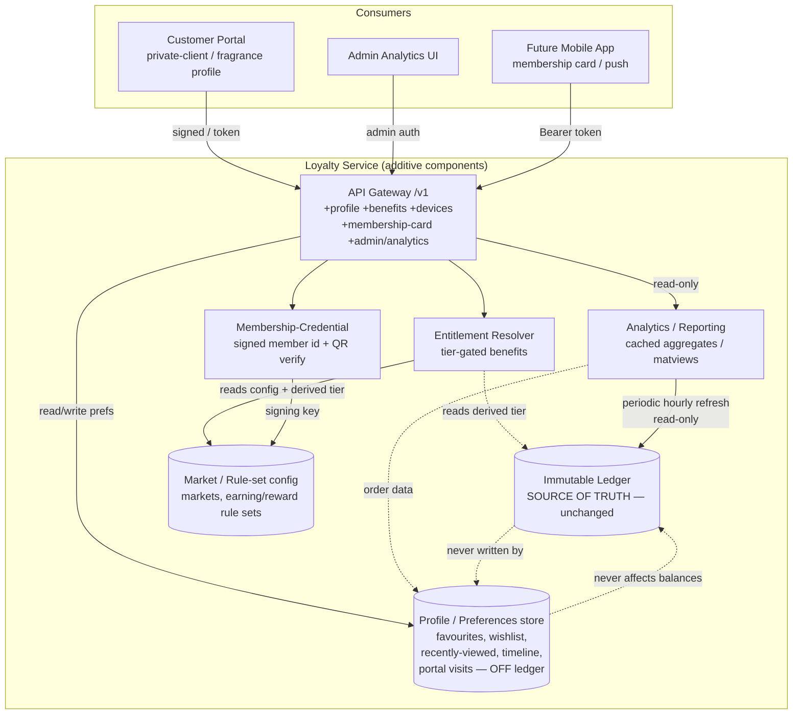
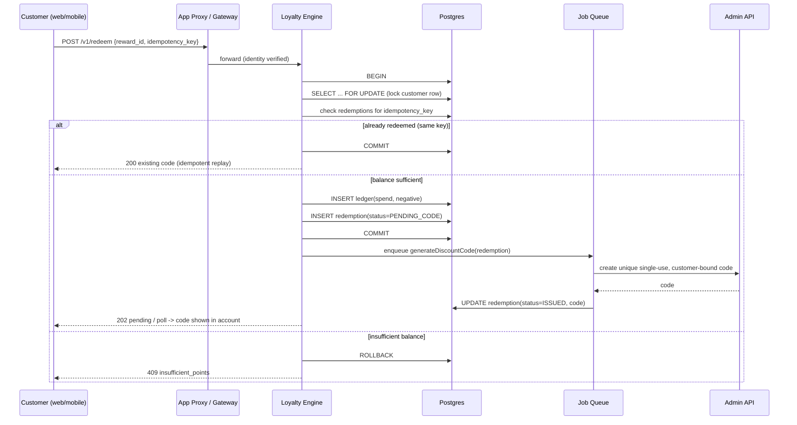

# Design Document: Athoor Loyalty Platform

> **Status: DESIGN / PLANNING ONLY.** This document proposes an architecture and plan. **No live changes** to the Shopify store, theme, customer metafields, or any data will be made until this spec is explicitly approved. Every section below is a proposal pending sign-off.

## Overview

The Athoor Loyalty Platform is an **API-first loyalty ecosystem** for the Athoor London Shopify store (`myathoorlondon.myshopify.com`, Basic plan). It replaces today's non-transactional, metafield-based "rewards club" — where redemption is a `mailto:` link and points are stored in customer metafields — with a **standalone loyalty microservice (Node.js + PostgreSQL)** that acts as the single source of truth via an **immutable transaction ledger**.

The platform is deliberately architected so the **same versioned API** serves three consumers over time: (1) the existing luxury web dashboard *today* via Shopify App Proxy, (2) a **luxury customer portal**, and (3) a **future native mobile app** — all authenticating against **Shopify's Customer Account API** rather than any custom auth we build and maintain. Shopify customer metafields are demoted to an *optional display cache*, written asynchronously by the service so the existing LV-inspired Liquid dashboard keeps rendering with zero visual regression.

Because the store is on the **Basic plan** (no Shopify Flow, no checkout customization), *all* automation lives in the external backend. The service consumes Shopify webhooks (`customers/create`, `orders/paid`, `refunds/create`, `orders/cancelled`) with HMAC verification and idempotency protection, and calls the Admin API outbound to mint **unique, single-use, customer-bound discount codes** on redemption. This design covers the system architecture, Postgres data model, Shopify integration contracts, earn/redeem/refund/expiry algorithms with correctness properties, security, error handling and recovery, hosting and cost estimates, a data-safe phased migration for the 8 enrolled customers, and a recommended MVP-first build order.

## Goals and Non-Goals

### Goals
- Single source of truth: an **append-only ledger** in Postgres with atomic, concurrency-safe balance math.
- Automated redemption: replace `mailto:` with auto-generated single-use Shopify discount codes.
- Correct earning: signup, paid-order with tier multipliers, first-purchase, referral, with **refund/cancellation clawback**.
- FIFO points expiry with pre-expiry notifications.
- Versioned API reused by web dashboard now and mobile app later.
- Preserve the existing luxury LV-style dashboard UI exactly.
- Data-safe, reversible migration of the 8 enrolled + 31 non-enrolled customers.

### Non-Goals (explicitly out of scope for this design)
- Building custom authentication (we adopt Shopify Customer Account API).
- Customizing the Shopify checkout page (not possible on Basic plan).
- Enforcing Instagram-follow points automatically (not verifiable via any API — see Limitations).
- Shipping the native mobile app itself (we only guarantee API compatibility for it).
- Replacing the storefront theme or introducing a generic third-party loyalty widget.

## Known Shopify / Basic-Plan Constraints (design drivers)

| Constraint | Design consequence |
|---|---|
| No Shopify Flow on Basic | All automation runs in the external Node backend triggered by webhooks. |
| Checkout page not customizable | "Points earned at checkout" cannot be shown; surface points post-purchase in the dashboard / order-status page / email instead. |
| Instagram-follow not verifiable via API | Drop as an automated rule; optional manual credit via admin tool. |
| Review points need a reviews app that emits webhooks | Design a generic inbound "event" endpoint; wire reviews only if such an app exists. |
| Admin API rate limits (GraphQL cost-based / REST bucket) | Outbound calls go through a queue with backoff; never call Admin API synchronously inside a webhook handler. |
| Metafields non-transactional, rate-limited, not queryable | Postgres ledger is the source of truth; metafields are a best-effort display cache only. |
| Storefront Liquid can only READ metafields | Writes happen exclusively from the backend via Admin API. |

## Architecture

The system is a classic three-tier split: **Shopify (edge + identity + storefront)**, the **Loyalty Service (brain + source of truth)**, and **consumers (web dashboard now, mobile app later)**. Shopify never holds authoritative loyalty state; it emits events and receives display updates.



**Key architectural decisions:**

1. **Ledger-first.** Every point movement is an immutable row. Balance is a projection (sum) of the ledger, never a mutable counter. This gives auditability, correct refunds, and safe concurrency.
2. **Webhooks in, queue out.** Webhook handlers do the minimum (verify, dedupe, write ledger, enqueue) and return `200` fast. All slow/rate-limited work (Admin API, email) is deferred to the queue with retry/backoff.
3. **App Proxy for web, Bearer for mobile — one API.** The web dashboard calls `/apps/loyalty/...`; Shopify signs and forwards to the same `/v1` endpoints the mobile app will call directly with a Customer Account API token. The engine is identity-source agnostic after auth resolves a `customer_id`.
4. **Metafields as cache.** After any balance change, a job writes `loyalty.points_balance`, `tier`, etc. back to metafields so the existing Liquid dashboard renders unchanged even if the API is briefly unavailable.

### Additive Architecture Extensions (Requirements 16–21)

> **Additive-only.** The following components extend the architecture to serve Requirements 16–21 (private-client portal, fragrance profile, VIP entitlements, mobile readiness, admin analytics, international expansion). **The ledger-first core is unchanged**: none of these components write to `ledger_entries`, and none become an alternative source of truth. Behavioural/preference data lives in a **separate Profile/Preferences store**; analytics are **derived, cached projections** of the immutable ledger plus Shopify order data.

Four new components join the Loyalty Service, plus a new logical store:

1. **Entitlement Resolver** — a pure, read-only resolver that, given a customer's current tier, returns the set of configured `benefits` whose `min_qualifying_tier` is satisfied. It denies any tier-gated benefit below the minimum tier (Requirement 18). It reads only `benefits` config + the customer's derived tier; it never mutates state.
2. **Analytics / Reporting** — computes CLV, repeat purchase rate, loyalty engagement, redemption/reward behaviour, and Royal_VIP growth **solely** from the immutable ledger + Shopify order data. It reads from **cached aggregates / materialized views** refreshed periodically (hourly per A12) so analytics never scan the live ledger under load. Admin-authenticated (Requirements 10 & 20).
3. **Membership-Credential service** — issues a verifiable, signed member identifier for the Digital Membership Card and QR-based verification, and exposes a verification endpoint. Uses a **new dedicated signing key** held in secrets management (Requirement 19).
4. **Profile / Preferences store** — owns behavioural and preference data (favourites, wishlist, recently-viewed, journey timeline, portal-visit state) in tables **separate from the ledger**. High-volume recently-viewed writes are kept off the ledger entirely (Requirement 17).

Configuration is externalised into **market / rule-set config** (`markets`, `earning_rule_sets`, `reward_rule_sets`) so tier thresholds, multipliers, and the reward map move out of hardcoded constants — i18n/multi-market readiness (Requirement 21). The ledger stays currency-agnostic (points are unitless); only money-bearing records carry an explicit currency.



### Data Flow: Earning (paid order)

```mermaid
sequenceDiagram
    participant S as Shopify
    participant W as Webhook Receiver
    participant E as Loyalty Engine
    participant DB as Postgres
    participant Q as Job Queue
    participant A as Admin API

    S->>W: POST orders/paid (+HMAC header)
    W->>W: Verify HMAC, check webhook_events dedupe
    alt duplicate event
        W-->>S: 200 OK (no-op)
    else new event
        W->>DB: INSERT webhook_events (event_id)
        W->>E: process(order)
        E->>E: resolve tier, compute points = floor(eligible_total * multiplier)
        E->>DB: BEGIN; INSERT ledger(earn) + point_lot; recompute tier; COMMIT
        E->>Q: enqueue writeMetafieldCache(customer)
        W-->>S: 200 OK
        Q->>A: update customer metafields (balance, tier)
    end
```

### Data Flow: Redemption (concurrency-safe)



### Data Flow: Refund / Cancellation clawback

```mermaid
sequenceDiagram
    participant S as Shopify
    participant W as Webhook Receiver
    participant E as Loyalty Engine
    participant DB as Postgres

    S->>W: POST refunds/create or orders/cancelled (+HMAC)
    W->>W: Verify HMAC + dedupe
    W->>E: process(refund)
    E->>DB: find original earn ledger rows for order
    E->>E: compute clawback = points earned on refunded amount
    E->>DB: BEGIN; INSERT ledger(clawback, negative, reason=refund); recompute tier; COMMIT
    Note over E,DB: Balance may go negative-safe:<br/>clamp per policy (never below 0 unless allow_negative)
    W-->>S: 200 OK
```

### Data Flow: Expiry (scheduled, FIFO)

```mermaid
sequenceDiagram
    participant CR as Scheduler (daily)
    participant E as Loyalty Engine
    participant DB as Postgres
    participant Q as Job Queue

    CR->>E: runExpiryScan(today)
    E->>DB: SELECT point_lots WHERE expires_at <= today AND remaining > 0
    loop each expiring lot
        E->>DB: INSERT ledger(expire, negative, reason, lot_ref); set lot.remaining=0
    end
    CR->>E: runPreExpiryNotify(today + N days)
    E->>DB: SELECT lots expiring within N days
    E->>Q: enqueue preExpiryEmail(customer, amount, date)
```

## Components and Interfaces

### Component 1: Webhook Receiver
**Purpose**: Terminate inbound Shopify webhooks safely and fast.
**Responsibilities**: Verify HMAC signature; enforce idempotency via `webhook_events`; persist the raw event; hand off to the engine; always respond `200` quickly (even for duplicates) so Shopify does not retry-storm.

```typescript
interface WebhookReceiver {
  // Returns 200 for accepted OR duplicate; throws only on auth failure (401).
  handle(topic: WebhookTopic, rawBody: Buffer, headers: WebhookHeaders): Promise<HandlerResult>
}

type WebhookTopic =
  | "customers/create"
  | "orders/paid"
  | "refunds/create"
  | "orders/cancelled"

interface WebhookHeaders {
  hmacSha256: string          // X-Shopify-Hmac-Sha256
  topic: string               // X-Shopify-Topic
  shopDomain: string          // X-Shopify-Shop-Domain
  webhookId: string           // X-Shopify-Webhook-Id (idempotency key)
}
```

### Component 2: Loyalty Engine
**Purpose**: All business rules; the only writer to the ledger.
**Responsibilities**: earn, redeem, clawback, expiry, tier recomputation. Wraps every mutation in a DB transaction with row locking.

```typescript
interface LoyaltyEngine {
  earnSignup(customerId: CustomerId): Promise<LedgerEntry>
  earnOrder(customerId: CustomerId, order: OrderContext): Promise<LedgerEntry[]>
  earnFirstPurchase(customerId: CustomerId, order: OrderContext): Promise<LedgerEntry | null>
  earnReferral(referrerId: CustomerId, event: ReferralEvent): Promise<LedgerEntry>
  clawback(customerId: CustomerId, refund: RefundContext): Promise<LedgerEntry[]>
  redeem(customerId: CustomerId, rewardId: RewardId, idempotencyKey: string): Promise<Redemption>
  expireLots(asOf: Date): Promise<ExpiryResult>
  getBalance(customerId: CustomerId): Promise<BalanceSummary>
  getHistory(customerId: CustomerId, page: Pagination): Promise<LedgerPage>
}
```

### Component 3: Shopify Admin Gateway (outbound, queued)
**Purpose**: The only component that calls the Admin API. Rate-limit aware.
**Responsibilities**: Generate discount codes; write metafield display cache. Runs from the job queue with exponential backoff and respects Shopify's cost/bucket throttling.

```typescript
interface ShopifyAdminGateway {
  createSingleUseDiscount(input: DiscountInput): Promise<DiscountCode>
  writeMetafieldCache(customerId: CustomerId, snapshot: CacheSnapshot): Promise<void>
}

interface DiscountInput {
  customerGid: string          // bind code to this customer only
  amountOffGBP: number         // e.g. 5, 15, 35, 75
  code: string                 // generated unique code, e.g. ATH-9F3K-... 
  usageLimit: 1                // single use
  appliesOncePerCustomer: true
  redemptionId: RedemptionId   // for reconciliation
}
```

### Component 4: API Gateway (versioned, consumer-facing)
**Purpose**: Single entry for web (via App Proxy) and mobile (via Bearer token). Resolves identity → `customerId`, then delegates to the engine.
**Responsibilities**: App Proxy signature verification for web; Customer Account API token validation for mobile; rate limiting; request/response shaping.

```typescript
// All endpoints under /v1. Identity resolved before handler runs.
interface LoyaltyAPI {
  "GET  /v1/balance":  (ctx: AuthCtx) => Promise<BalanceSummary>
  "GET  /v1/history":  (ctx: AuthCtx, q: Pagination) => Promise<LedgerPage>
  "GET  /v1/rewards":  (ctx: AuthCtx) => Promise<Reward[]>
  "POST /v1/redeem":   (ctx: AuthCtx, body: RedeemBody) => Promise<RedemptionResult>
  "GET  /v1/referral": (ctx: AuthCtx) => Promise<ReferralInfo>

  // --- Additive-only groups (Requirements 16–21). All under /v1; breaking changes would be /v2 (Req 9.4/9.5). ---

  // Profile / Preferences (Requirements 16, 17)
  "GET   /v1/profile":                  (ctx: AuthCtx) => Promise<FragranceProfile>
  "GET   /v1/profile/favourites":       (ctx: AuthCtx) => Promise<string[]>
  "PUT   /v1/profile/favourites/:id":   (ctx: AuthCtx, on: boolean) => Promise<void>
  "GET   /v1/profile/wishlist":         (ctx: AuthCtx) => Promise<string[]>
  "POST  /v1/profile/wishlist/reconcile": (ctx: AuthCtx, deviceLocal: string[]) => Promise<string[]> // union, A14
  "POST  /v1/profile/recently-viewed":  (ctx: AuthCtx, productId: string) => Promise<void> // rate-limited/sampled, OFF-ledger
  "GET   /v1/profile/suggestions":      (ctx: AuthCtx) => Promise<string[]>                 // stable interface, A11
  "GET   /v1/profile/journey":          (ctx: AuthCtx) => Promise<JourneyMilestone[]>
  "POST  /v1/profile/visit":            (ctx: AuthCtx) => Promise<{ firstVisit: boolean }>  // Req 16.1/16.2

  // VIP entitlements (Requirement 18)
  "GET   /v1/benefits":                 (ctx: AuthCtx) => Promise<Benefit[]>
  "POST  /v1/benefits/:key/request":    (ctx: AuthCtx, idempotencyKey: string) => Promise<BenefitRequest>

  // Mobile readiness (Requirement 19)
  "POST   /v1/devices":                 (ctx: AuthCtx, body: DeviceRegistration) => Promise<void> // register Device_Token
  "DELETE /v1/devices/:token":          (ctx: AuthCtx) => Promise<void>                            // de-register
  "GET    /v1/membership-card":         (ctx: AuthCtx) => Promise<MembershipCredential>            // signed id + QR + tier
  "GET    /v1/membership-card/verify":  (signedMemberId: string) => Promise<{ valid: boolean; tier?: string }>

  // Admin analytics (Requirements 10 & 20) — admin-authenticated
  "GET   /v1/admin/analytics":          (admin: AdminCtx, q: DateRange) => Promise<AnalyticsResult>
}

interface RedeemBody { rewardId: RewardId; idempotencyKey: string }
interface AuthCtx { customerId: CustomerId; source: "app_proxy" | "customer_account_api"; channel: "web" | "app" }
interface AdminCtx { adminUserId: string; role: "admin" }
interface DeviceRegistration { token: string; platform: "ios" | "android" }
```

### Component 5: Scheduler
**Purpose**: Time-driven jobs that Shopify cannot trigger.
**Responsibilities**: Daily FIFO expiry scan; pre-expiry notification sweep; optional metafield cache reconciliation. **(Additive)** Also refreshes the Analytics cached aggregates / materialized views on an hourly cadence (A12).

### Component 6: Entitlement Resolver (additive — Requirement 18)
**Purpose**: Resolve the set of configurable, tier-gated Benefits a customer currently qualifies for. Read-only; never mutates state.
**Responsibilities**: Given a customer's derived tier, return every `benefit` whose `min_qualifying_tier` is met; deny any benefit gated above the customer's tier; record `benefit_requests` (e.g. private-consultation booking) when a qualifying member invokes an enabled benefit. New Benefit types are added by configuration, with no schema redesign.

```typescript
interface EntitlementResolver {
  // Benefits the customer's current tier qualifies for (Req 18.2).
  resolveBenefits(customerId: CustomerId): Promise<Benefit[]>
  // True iff the customer's tier >= benefit.minQualifyingTier (Req 18.3, 18.6).
  qualifies(customerId: CustomerId, benefitKey: string): Promise<boolean>
  // Record a benefit invocation (e.g. consultation booking) when qualified (Req 18.5);
  // denies + returns required tier when not qualified (Req 18.6).
  requestBenefit(customerId: CustomerId, benefitKey: string): Promise<BenefitRequest>
}

interface Benefit {
  key: string
  name: string
  minQualifyingTier: "bronze" | "silver" | "gold" | "royal_vip"
  config: Record<string, unknown>   // future perk-specific config (JSONB)
  active: boolean
}
```

### Component 7: Analytics / Reporting (additive — Requirements 10 & 20)
**Purpose**: Compute loyalty-program analytics for admins, derived **solely** from the immutable ledger + Shopify order data. No separate mutable source of truth.
**Responsibilities**: CLV, repeat purchase rate, loyalty engagement (enrolled %, active %), most-rewarded customers, redemption behaviour (redemption rate, reward-tier popularity), Royal_VIP growth over a date range. Serves from **cached aggregates / materialized views** refreshed hourly (A12) so live-ledger scans are avoided under load; every response carries the `computedAt` timestamp. Admin-authenticated (ties to Requirement 10 criterion 1).

```typescript
interface AnalyticsService {
  getOverview(range: DateRange): Promise<AnalyticsResult>   // admin-only
}

interface AnalyticsResult {
  range: DateRange
  clv: number
  repeatPurchaseRate: number
  engagement: { enrolledPct: number; activePct: number }
  mostRewardedCustomers: Array<{ customerId: CustomerId; points: number }>
  redemption: { redemptionRate: number; rewardTierPopularity: Record<RewardId, number> }
  royalVipGrowth: Array<{ period: string; count: number }>
  computedAt: string   // ISO 8601 — when the cached metrics were computed (Req 20.6, A12)
}
```

### Component 8: Membership-Credential Service (additive — Requirement 19)
**Purpose**: Issue and verify a signed, verifiable member identifier for the Digital Membership Card and QR-based identification, and expose the member id + tier needed for a future mobile wallet pass.
**Responsibilities**: Sign a member identifier with a **new dedicated signing key** (held in secrets management, rotated on schedule); verify a presented identifier belongs to a member **without exposing any other customer's data** (Req 19.5); expose member id + tier via `/v1` for wallet-pass readiness (Req 19.6). Signing/verification only — no ledger interaction.

```typescript
interface MembershipCredentialService {
  issueCredential(customerId: CustomerId): Promise<MembershipCredential>   // signed id + QR payload
  verifyCredential(signedMemberId: string): Promise<{ valid: boolean; tier?: string }>
}

interface MembershipCredential {
  memberId: string        // opaque, non-PII-bearing
  tier: string
  signature: string       // signed with dedicated membership signing key
  qrPayload: string
}
```

### Component 9: Profile / Preferences Service (additive — Requirements 16 & 17)
**Purpose**: Own behavioural and preference data — favourites, wishlist, recently-viewed, fragrance journey timeline, portal-visit state — in a store **separate from the ledger**. Behavioural data **never** touches `ledger_entries` and **never** affects balances.
**Responsibilities**: Persist favourites/wishlist/recently-viewed; reconcile the device-local `shopify-wishlist` localStorage into the account-level wishlist as a **union** on authentication (A14); apply the 90-day recently-viewed retention window (A10); compose purchased fragrances (from Shopify orders) + rules-based suggestions (A11, behind a stable interface) + journey timeline; track first-visit vs returning-member portal state (Requirement 16). Recently-viewed ingestion is **rate-limited/sampled and off-ledger** to absorb high write volume.

```typescript
interface ProfileService {
  getFragranceProfile(customerId: CustomerId): Promise<FragranceProfile>
  setFavourite(customerId: CustomerId, productId: string, on: boolean): Promise<void>
  getWishlist(customerId: CustomerId): Promise<string[]>
  reconcileWishlist(customerId: CustomerId, deviceLocal: string[]): Promise<string[]> // union (A14)
  recordView(customerId: CustomerId, productId: string): Promise<void>  // rate-limited/sampled, off-ledger
  getSuggestions(customerId: CustomerId): Promise<string[]>             // stable interface (A11)
  getJourneyTimeline(customerId: CustomerId): Promise<JourneyMilestone[]>
  markPortalVisit(customerId: CustomerId): Promise<{ firstVisit: boolean }> // Req 16.1/16.2
}
```

## Data Models

_PostgreSQL. The schema centers on an append-only ledger._

The schema centers on an **append-only ledger**. Balance and tier are always derived; no field is mutated in place except the denormalized `remaining_points` on a point-lot (for FIFO efficiency) which is itself only ever decreased and is fully reconstructable from the ledger.

```sql
-- Customers: mirror of Shopify identity, keyed by Shopify customer id.
CREATE TABLE customers (
    id                  UUID PRIMARY KEY DEFAULT gen_random_uuid(),
    shopify_customer_id BIGINT UNIQUE NOT NULL,     -- numeric Shopify id
    email               CITEXT,
    tier                TEXT NOT NULL DEFAULT 'bronze',   -- derived, cached for reads
    lifetime_points     BIGINT NOT NULL DEFAULT 0,        -- derived, cached for reads
    lifetime_spend_gbp  NUMERIC(12,2) NOT NULL DEFAULT 0, -- drives tier
    referral_code       TEXT UNIQUE,
    referred_by         UUID REFERENCES customers(id),    -- self-referral guard
    enrolled_at         TIMESTAMPTZ,
    created_at          TIMESTAMPTZ NOT NULL DEFAULT now(),
    updated_at          TIMESTAMPTZ NOT NULL DEFAULT now()
);

-- The immutable ledger: the single source of truth. Never UPDATE/DELETE rows.
CREATE TABLE ledger_entries (
    id                  UUID PRIMARY KEY DEFAULT gen_random_uuid(),
    customer_id         UUID NOT NULL REFERENCES customers(id),
    entry_type          TEXT NOT NULL,   -- earn_signup | earn_order | earn_first_purchase
                                         -- | earn_referral | spend | clawback | expire | adjust | migration
    points              BIGINT NOT NULL, -- positive for credit, negative for debit
    reason              TEXT NOT NULL,
    order_reference     BIGINT,          -- Shopify order id when applicable
    point_lot_id        UUID,            -- links spend/expire back to the lot consumed
    redemption_id       UUID,            -- links spend to a redemption
    source_event_id     TEXT,            -- Shopify webhook id for traceability
    created_at          TIMESTAMPTZ NOT NULL DEFAULT now()
);
CREATE INDEX idx_ledger_customer ON ledger_entries(customer_id, created_at);

-- Point lots: each earning creates a lot with an expiry date for FIFO consumption.
--
-- INVARIANT (Property 17): EVERY Balance-increasing ledger entry gets a matching
-- lot of the same amount — signup, order, first-purchase and referral earnings
-- (12-month expiry), positive admin adjustments and manual credits (12-month
-- expiry), and migration entries plus failed-redemption reversals (non-expiring,
-- `expires_at = NULL`). Spendable_Balance is derived solely from lots, so an
-- unbacked credit would be permanently unspendable.
CREATE TABLE point_lots (
    id                  UUID PRIMARY KEY DEFAULT gen_random_uuid(),
    customer_id         UUID NOT NULL REFERENCES customers(id),
    ledger_entry_id     UUID NOT NULL REFERENCES ledger_entries(id),
    original_points     BIGINT NOT NULL CHECK (original_points > 0),
    remaining_points    BIGINT NOT NULL CHECK (remaining_points >= 0),
    earned_at           TIMESTAMPTZ NOT NULL DEFAULT now(),
    expires_at          TIMESTAMPTZ,     -- NULL = never expires
    CHECK (remaining_points <= original_points)
);
CREATE INDEX idx_lots_fifo ON point_lots(customer_id, earned_at)
    WHERE remaining_points > 0;
CREATE INDEX idx_lots_expiry ON point_lots(expires_at)
    WHERE remaining_points > 0;

-- Redemptions: a spend that produces a Shopify discount code.
CREATE TABLE redemptions (
    id                  UUID PRIMARY KEY DEFAULT gen_random_uuid(),
    customer_id         UUID NOT NULL REFERENCES customers(id),
    reward_id           TEXT NOT NULL,          -- e.g. reward_5, reward_15
    points_spent        BIGINT NOT NULL CHECK (points_spent > 0),
    value_gbp           NUMERIC(8,2) NOT NULL,
    status              TEXT NOT NULL DEFAULT 'pending_code', -- pending_code | issued | failed | voided
    idempotency_key     TEXT NOT NULL,
    discount_code_id    UUID REFERENCES discount_codes(id),
    created_at          TIMESTAMPTZ NOT NULL DEFAULT now(),
    UNIQUE (customer_id, idempotency_key)        -- double-submit protection
);

-- Discount codes minted in Shopify, one per redemption, single-use, customer-bound.
CREATE TABLE discount_codes (
    id                    UUID PRIMARY KEY DEFAULT gen_random_uuid(),
    redemption_id         UUID NOT NULL REFERENCES redemptions(id),
    code                  TEXT UNIQUE NOT NULL,
    shopify_price_rule_id BIGINT,
    shopify_discount_id   BIGINT,
    amount_off_gbp        NUMERIC(8,2) NOT NULL,
    status                TEXT NOT NULL DEFAULT 'active', -- active | used | expired | revoked
    created_at            TIMESTAMPTZ NOT NULL DEFAULT now()
);

-- Webhook dedupe / audit: every inbound event recorded once.
CREATE TABLE webhook_events (
    id                  UUID PRIMARY KEY DEFAULT gen_random_uuid(),
    shopify_webhook_id  TEXT UNIQUE NOT NULL,    -- X-Shopify-Webhook-Id: idempotency anchor
    topic               TEXT NOT NULL,
    payload_hash        TEXT NOT NULL,
    received_at         TIMESTAMPTZ NOT NULL DEFAULT now(),
    processed_at        TIMESTAMPTZ,
    status              TEXT NOT NULL DEFAULT 'received' -- received | processed | failed
);

-- Referrals: track invite -> signup -> first purchase for staged rewards + fraud guard.
CREATE TABLE referrals (
    id                  UUID PRIMARY KEY DEFAULT gen_random_uuid(),
    referrer_id         UUID NOT NULL REFERENCES customers(id),
    referred_id         UUID REFERENCES customers(id),
    referred_email      CITEXT,
    signup_rewarded     BOOLEAN NOT NULL DEFAULT false,
    purchase_rewarded   BOOLEAN NOT NULL DEFAULT false,
    created_at          TIMESTAMPTZ NOT NULL DEFAULT now(),
    CHECK (referrer_id <> referred_id)           -- no self-referral
);
```

### Additive Data Models (Requirements 16–21)

> **Additive-only. The immutable ledger core is unchanged.** `ledger_entries`, `point_lots`, `redemptions`, `discount_codes`, `webhook_events`, `referrals`, and `customers` all stay exactly as defined above. The tables below live **alongside** the ledger. Behavioural/preference data (favourites, wishlist, recently-viewed) is a **separate store and is never written to the ledger and never affects balances**. Money-bearing configuration carries an explicit currency; the ledger itself remains currency-agnostic (points are unitless).

```sql
-- Behavioural / preference store (Requirement 17). SEPARATE from the ledger — never affects balances.

-- Favourites: fragrances a customer has explicitly marked. One row per customer+product.
CREATE TABLE customer_favourites (
    customer_id         UUID NOT NULL REFERENCES customers(id),
    shopify_product_id  BIGINT NOT NULL,
    created_at          TIMESTAMPTZ NOT NULL DEFAULT now(),
    PRIMARY KEY (customer_id, shopify_product_id)   -- unique per customer+product
);

-- Account-level wishlist (Requirement 17.4, A14). Reconciled as a UNION with the device-local
-- `shopify-wishlist` localStorage entry on authentication; authoritative thereafter.
CREATE TABLE customer_wishlist (
    customer_id         UUID NOT NULL REFERENCES customers(id),
    shopify_product_id  BIGINT NOT NULL,
    added_at            TIMESTAMPTZ NOT NULL DEFAULT now(),
    PRIMARY KEY (customer_id, shopify_product_id)
);

-- Recently viewed (A10: 90-day retention). HIGH WRITE VOLUME — deliberately kept OFF the ledger.
-- Ingestion is rate-limited/sampled; entries older than the retention window are excluded from the profile.
CREATE TABLE customer_recently_viewed (
    customer_id         UUID NOT NULL REFERENCES customers(id),
    shopify_product_id  BIGINT NOT NULL,
    viewed_at           TIMESTAMPTZ NOT NULL DEFAULT now(),
    PRIMARY KEY (customer_id, shopify_product_id)   -- upsert viewed_at on repeat view
);
CREATE INDEX idx_recently_viewed_retention ON customer_recently_viewed(customer_id, viewed_at);

-- Tier change history: powers the Fragrance_Journey_Timeline and Royal_VIP-growth analytics.
CREATE TABLE tier_change_history (
    id                  UUID PRIMARY KEY DEFAULT gen_random_uuid(),
    customer_id         UUID NOT NULL REFERENCES customers(id),
    from_tier           TEXT,
    to_tier             TEXT NOT NULL,
    reason              TEXT NOT NULL,
    created_at          TIMESTAMPTZ NOT NULL DEFAULT now()
);
CREATE INDEX idx_tier_history_customer ON tier_change_history(customer_id, created_at);

-- Portal visit tracking (Requirement 16): drives first-visit vs returning-member experience.
CREATE TABLE portal_visits (
    customer_id         UUID PRIMARY KEY REFERENCES customers(id),
    first_visited_at    TIMESTAMPTZ NOT NULL DEFAULT now(),
    last_visited_at     TIMESTAMPTZ NOT NULL DEFAULT now()
);

-- Configurable, tier-gated entitlements (Requirement 18). New Benefit types added by config — no schema redesign.
CREATE TABLE benefits (
    id                  UUID PRIMARY KEY DEFAULT gen_random_uuid(),
    key                 TEXT UNIQUE NOT NULL,       -- e.g. private_consultation, exclusive_release
    name                TEXT NOT NULL,
    min_qualifying_tier TEXT NOT NULL,              -- bronze | silver | gold | royal_vip
    config              JSONB NOT NULL DEFAULT '{}',-- perk-specific config for future types (A13)
    active              BOOLEAN NOT NULL DEFAULT true
);

CREATE TABLE benefit_requests (
    id                  UUID PRIMARY KEY DEFAULT gen_random_uuid(),
    customer_id         UUID NOT NULL REFERENCES customers(id),
    benefit_id          UUID NOT NULL REFERENCES benefits(id),
    status              TEXT NOT NULL DEFAULT 'requested', -- requested | confirmed | fulfilled | cancelled
    requested_at        TIMESTAMPTZ NOT NULL DEFAULT now()
);
CREATE INDEX idx_benefit_requests_customer ON benefit_requests(customer_id, requested_at);

-- Push-notification device registration for a FUTURE mobile app (Requirement 19). Delivery is future.
CREATE TABLE device_tokens (
    id                  UUID PRIMARY KEY DEFAULT gen_random_uuid(),
    customer_id         UUID NOT NULL REFERENCES customers(id),
    token               TEXT NOT NULL,
    platform            TEXT NOT NULL,              -- ios | android
    created_at          TIMESTAMPTZ NOT NULL DEFAULT now(),
    revoked_at          TIMESTAMPTZ,               -- set on de-registration
    UNIQUE (customer_id, token)
);

-- Market / currency / rule-set configuration (Requirement 21). i18n & multi-market readiness.
-- The ledger stays currency-agnostic (points unitless); money-bearing records carry explicit currency.
CREATE TABLE markets (
    id                  UUID PRIMARY KEY DEFAULT gen_random_uuid(),
    code                TEXT UNIQUE NOT NULL,       -- e.g. UK
    base_currency       TEXT NOT NULL DEFAULT 'GBP',-- A8: Base_Currency = GBP
    language            TEXT NOT NULL DEFAULT 'en',
    active              BOOLEAN NOT NULL DEFAULT true
);

-- Earning rule sets keyed by market: tier thresholds + multipliers moved out of hardcoded constants.
CREATE TABLE earning_rule_sets (
    id                  UUID PRIMARY KEY DEFAULT gen_random_uuid(),
    market_id           UUID NOT NULL REFERENCES markets(id),
    currency            TEXT NOT NULL DEFAULT 'GBP',-- money-bearing: explicit currency
    tier_thresholds     JSONB NOT NULL,            -- { bronze:0, silver:300, gold:750, royal_vip:1500 } in currency
    tier_multipliers    JSONB NOT NULL,            -- { bronze:1, silver:1.5, gold:2, royal_vip:3 }
    active              BOOLEAN NOT NULL DEFAULT true,
    UNIQUE (market_id, active)
);

-- Reward rule sets keyed by market: reward map moved out of hardcoded constants.
CREATE TABLE reward_rule_sets (
    id                  UUID PRIMARY KEY DEFAULT gen_random_uuid(),
    market_id           UUID NOT NULL REFERENCES markets(id),
    currency            TEXT NOT NULL DEFAULT 'GBP',-- money-bearing: explicit currency
    reward_map          JSONB NOT NULL,            -- { reward_5:{cost:100,value:5}, ... } value in currency
    active              BOOLEAN NOT NULL DEFAULT true,
    UNIQUE (market_id, active)
);
```

**Channel attribution (Requirement 19).** To support app-exclusive rewards, the channel that attributes a reward/redemption is recorded explicitly. This is additive:

```sql
-- Additive column; existing rows default to 'web'. Ledger context can also carry channel where needed.
ALTER TABLE redemptions ADD COLUMN channel TEXT NOT NULL DEFAULT 'web';  -- web | app
```

**Validation rules & invariants**
- `SUM(ledger_entries.points) == balance` for each customer at all times (balance is never stored authoritatively).
- `SUM(point_lots.remaining_points) == current spendable balance` (expired/spent lots decremented).
- A `spend` or `clawback` entry is always negative; an `earn_*` entry is always positive.
- `redemptions.idempotency_key` unique per customer → the same client retry never double-spends.
- `referrals.referrer_id <> referred_id` and `customers.referred_by` guard self-referral.
- **(Additive)** Behavioural/preference data (`customer_favourites`, `customer_wishlist`, `customer_recently_viewed`) is **never** written to `ledger_entries` and has **no effect on any customer's Balance or Spendable_Balance**. *(Property 13)*
- **(Additive)** The Entitlement Resolver grants a Benefit to a customer **iff** the customer's current tier ≥ `benefits.min_qualifying_tier`; a benefit gated above the customer's tier is never granted. *(Property 14)*
- **(Additive)** An app-exclusive reward is granted **only** when the attributed `channel = 'app'`. *(Property 15)*
- **(Additive)** Admin_Analytics values are pure projections of `ledger_entries` + Shopify order data; recomputing them from those sources reproduces the reported metrics (modulo the reported `computedAt` cache timestamp). *(Property 16)*
- **(Additive)** The ledger is currency-agnostic (points unitless); every money-bearing config/record (`earning_rule_sets`, `reward_rule_sets`, `markets`) carries an explicit currency (GBP at MVP, A8).

## Shopify Integration Contracts

### Inbound webhooks
All webhooks are registered via the Admin API at deploy time and verified on every request.

| Topic | Trigger | Engine action |
|---|---|---|
| `customers/create` | New customer registers | `earnSignup` (+50); create `referral_code`; if `referred_by` present, create `referrals` row |
| `orders/paid` | Order marked paid | `earnOrder` (£1=1pt × tier multiplier); `earnFirstPurchase` (+100) if first; advance referral stage |
| `refunds/create` | Partial/full refund | `clawback` proportional to refunded eligible amount |
| `orders/cancelled` | Order cancelled | `clawback` of full order's earned points |

**HMAC verification (mandatory on every webhook):**
```typescript
function verifyWebhook(rawBody: Buffer, hmacHeader: string, secret: string): boolean {
  const digest = crypto.createHmac("sha256", secret).update(rawBody).digest("base64")
  // constant-time compare to prevent timing attacks
  return crypto.timingSafeEqual(Buffer.from(digest), Buffer.from(hmacHeader))
}
```
Requests failing HMAC return `401` and are never processed. Verification uses the **raw** request body (not re-serialized JSON).

### Admin API scopes (updated — additive, reconciles Requirement 11 criterion 11)

The custom app requests these least-privilege Admin API scopes:

| Scope | Purpose |
|---|---|
| `read_customers` | Resolve customer identity; read customer records. |
| `write_discounts` | Mint single-use discount codes on redemption. |
| `write_price_rules` | Create the price rules backing discount codes. |
| `read_orders` | **(Added)** Derive purchased fragrances & suggestions (Requirement 17) and order-derived admin analytics (Requirement 20). |
| `read_products` | **(Added)** Resolve product data for the Fragrance_Profile — favourites, wishlist, recently-viewed, suggestions (Requirement 17). |
| webhook scopes | Subscribe to `customers/create`, `orders/paid`, `refunds/create`, `orders/cancelled`. |

> **Requirements reconciliation:** Requirement 11 criterion 11 currently lists only (`read_customers`, `write_discounts`, `write_price_rules`, webhook scopes). Requirements 17 (purchased fragrances/suggestions) and 20 (order-derived analytics) require **read access to orders and products**. R11.11 in `requirements.md` should be reconciled to add `read_orders` and `read_products` so the requirements and this design agree. See also the Security Considerations and Dependencies sections.

### Outbound: single-use discount codes
On redemption, the Admin Gateway creates a price rule + discount code bound to the customer:
- `usageLimit = 1`, `appliesOncePerCustomer = true`, `customerSelection = { customerIds: [gid] }`.
- Code format `ATH-XXXX-XXXX` (crypto-random, collision-checked against `discount_codes.code`).
- Value maps from reward tier: `100→£5, 250→£15, 500→£35, 1000→£75`.
- All Admin calls run in the queue with exponential backoff on `429`/throttle.

### App Proxy (web dashboard, today)
The theme's dashboard fetches `/apps/loyalty/v1/*`. Shopify forwards to the backend and appends a `signature` query param (HMAC of sorted query params with the app shared secret). The gateway verifies it before trusting the `logged_in_customer_id` Shopify injects.
```typescript
function verifyAppProxySignature(query: Record<string,string>, secret: string): boolean {
  const { signature, ...rest } = query
  const message = Object.keys(rest).sort().map(k => `${k}=${rest[k]}`).join("")
  const digest = crypto.createHmac("sha256", secret).update(message).digest("hex")
  return crypto.timingSafeEqual(Buffer.from(digest), Buffer.from(signature))
}
```

### Customer Account API (identity for web + mobile)
We do **not** build auth. The mobile app (and, where applicable, the portal) obtains a Customer Account API access token via Shopify's OAuth/new customer accounts flow. The gateway validates the token and resolves the Shopify customer id → local `customers.id`. App Proxy path trusts Shopify's signed `logged_in_customer_id`. Both converge on the same `AuthCtx`.

## Key Functions with Formal Specifications

### earnOrder()
```typescript
function earnOrder(customerId: CustomerId, order: OrderContext): Promise<LedgerEntry[]>
```
**Preconditions:**
- `customerId` references an existing, enrolled customer.
- `order.eligibleTotalGBP >= 0` (excludes shipping/tax/prior discounts per policy).
- The order's `orders/paid` event passed HMAC and dedupe (not previously processed).

**Postconditions:**
- Exactly one `earn_order` ledger entry created with `points = floor(eligibleTotalGBP * multiplier(tier))`.
- A matching `point_lot` created with `expires_at = now() + expiryWindow`.
- If first paid order: an additional `earn_first_purchase` entry (+100) and lot.
- `customer.lifetime_spend_gbp` increased; tier recomputed (monotonic non-decreasing within a transaction).
- Balance increases by exactly the sum of created entries; no other customer affected.

**Loop invariants:** N/A (no unbounded loop; multiplier is a table lookup).

### redeem()
```typescript
function redeem(customerId: CustomerId, rewardId: RewardId, idempotencyKey: string): Promise<Redemption>
```
**Preconditions:**
- `rewardId` is a known reward with a positive point cost.
- Customer row is lockable (`SELECT ... FOR UPDATE`).

**Postconditions:**
- If `idempotencyKey` already used by this customer → returns the existing redemption (no new spend).
- Else if `spendableBalance >= reward.cost` → one negative `spend` ledger entry; FIFO lots decremented; a `redemptions` row (`pending_code`); a queued job to mint the code. Balance decreases by exactly `reward.cost`.
- Else → transaction rolls back; no ledger change; `409 insufficient_points`.
- Never produces a negative spendable balance; never issues two codes for one spend.

**Loop invariants (FIFO consumption):**
- Before consuming lot *i*: `remainingToSpend > 0` and all lots `< i` have `remaining_points = 0` or were fully applied.
- `sum(applied so far) + remainingToSpend == reward.cost` holds each iteration.

### clawback()
```typescript
function clawback(customerId: CustomerId, refund: RefundContext): Promise<LedgerEntry[]>
```
**Preconditions:** refund references an order with prior `earn_order` entries.
**Postconditions:** negative entries totaling the points attributable to the refunded eligible amount; tier recomputed downward if lifetime spend drops below a threshold (policy: configurable whether clawback lowers tier). Balance never forced below 0 unless `allowNegative` policy is on.

### expireLots()
```typescript
function expireLots(asOf: Date): Promise<ExpiryResult>
```
**Preconditions:** runs in scheduler context; idempotent for a given `asOf` date.
**Postconditions:** every lot with `expires_at <= asOf AND remaining_points > 0` produces one negative `expire` entry equal to its `remaining_points`; lot set to `0`. Re-running the same day is a no-op.
**Loop invariants:** each processed lot's `remaining_points` transitions `>0 → 0` exactly once; total expired equals sum of matured lots' remaining.

## Algorithmic Pseudocode

### Tier multiplier and redemption (concurrency-safe core)
```typescript
const TIER_THRESHOLDS_GBP = { bronze: 0, silver: 300, gold: 750, royal_vip: 1500 }
const TIER_MULTIPLIER     = { bronze: 1, silver: 1.5, gold: 2, royal_vip: 3 }
const REWARDS = { reward_5: { cost: 100, gbp: 5 }, reward_15: { cost: 250, gbp: 15 },
                  reward_35: { cost: 500, gbp: 35 }, reward_75: { cost: 1000, gbp: 75 } }

async function redeem(customerId, rewardId, idempotencyKey) {
  const reward = REWARDS[rewardId]
  if (!reward) throw new Error("unknown_reward")

  return db.transaction(async (tx) => {
    // 1. Lock the customer to serialize concurrent redeems (prevents double-spend).
    await tx.query("SELECT id FROM customers WHERE id=$1 FOR UPDATE", [customerId])

    // 2. Idempotency: same key => return existing redemption, do not spend again.
    const existing = await tx.findRedemption(customerId, idempotencyKey)
    if (existing) return existing

    // 3. Balance check against derived spendable balance.
    const spendable = await tx.spendableBalance(customerId)
    if (spendable < reward.cost) throw new HttpError(409, "insufficient_points")

    // 4. Atomic spend: negative ledger entry + FIFO lot consumption.
    const entry = await tx.insertLedger({ customerId, entry_type: "spend",
                                          points: -reward.cost, reason: rewardId })
    let toSpend = reward.cost
    const lots = await tx.query(
      "SELECT * FROM point_lots WHERE customer_id=$1 AND remaining_points>0 ORDER BY earned_at ASC FOR UPDATE",
      [customerId])
    for (const lot of lots) {
      if (toSpend <= 0) break
      const take = Math.min(lot.remaining_points, toSpend)
      await tx.decrementLot(lot.id, take)   // remaining_points -= take
      toSpend -= take
    }
    // Invariant: toSpend === 0 here (guaranteed by step 3 balance check).

    // 5. Record redemption pending code, enqueue Shopify discount creation.
    const redemption = await tx.insertRedemption({ customerId, rewardId,
      points_spent: reward.cost, value_gbp: reward.gbp,
      status: "pending_code", idempotency_key: idempotencyKey, ledger_entry_id: entry.id })
    await queue.enqueue("generateDiscountCode", { redemptionId: redemption.id })
    return redemption
  })
}
```

## Correctness Properties

These are the invariants property-based and integration tests must hold. `∀` = "for all".

### Property 1: Ledger integrity
∀ customer c, `balance(c) == SUM(ledger_entries.points WHERE customer=c)`. Balance is never independently mutable.
**Validates: Requirements 1.2**

### Property 2: Spendable equals lots
∀ c, `spendableBalance(c) == SUM(point_lots.remaining_points WHERE customer=c AND not expired)`.
**Validates: Requirements 1.3**

### Property 3: No negative spendable
∀ redemption r, post-state `spendableBalance >= 0`.
**Validates: Requirements 3.4**

### Property 4: Redemption/spend conservation
∀ issued redemption r, `abs(spend_entry.points) == reward.cost == SUM(lot decrements)`.
**Validates: Requirements 3.2**

### Property 5: Idempotent redeem
Two `redeem` calls with the same `(customer, idempotencyKey)` produce exactly one spend and at most one discount code.
**Validates: Requirements 3.7**

### Property 6: Idempotent webhooks
Processing the same `X-Shopify-Webhook-Id` twice changes no balances.
**Validates: Requirements 12.2**

### Property 7: Earn correctness
∀ paid order o, `earned == floor(eligibleTotal(o) * multiplier(tier_at_time))` (+100 once if first purchase).
**Validates: Requirements 2.2**

### Property 8: Refund conservation
∀ refund f on order o, `clawback(f) <= totalEarned(o)`; full refund of a fully-earning order claws back exactly what it earned.
**Validates: Requirements 4.3**

### Property 9: Expiry once
∀ lot L, L contributes to at most one `expire` entry, equal to its remaining at maturity.
**Validates: Requirements 5.2**

### Property 10: Single-use codes
∀ redemption, exactly one Shopify discount code, `usageLimit=1`, bound to that customer.
**Validates: Requirements 3.5**

### Property 11: Tier monotonic per order
Processing a paid order never lowers a customer's tier.
**Validates: Requirements 7.3**

### Property 12: No self-referral reward
∀ referral, `referrer != referred`; a customer cannot earn referral points from their own signup.
**Validates: Requirements 11.8**

> **Additive properties (13–16) for Requirements 16–21.** Properties 1–12 above are unchanged. The following extend the correctness surface for behavioural data, entitlements, channel attribution, and analytics.

### Property 13: Behavioural data never affects ledger balances
∀ customer c and any sequence of behavioural operations (add/remove favourite, wishlist change, record recently-viewed, portal visit), `balance(c)` and `spendableBalance(c)` are unchanged. Behavioural/preference data is never written to `ledger_entries`.
**Validates: Requirements 17.3**

### Property 14: Entitlement gating correctness
∀ customer c and configured benefit b, the Entitlement Resolver grants b to c **iff** `tier(c) >= b.min_qualifying_tier`. No benefit gated above `tier(c)` is ever granted, and a tier-unqualified benefit invocation performs no state change and returns the required tier.
**Validates: Requirements 18.3**

### Property 15: App-exclusive channel gating
∀ reward r configured as app-exclusive and redemption attempt with attributed channel `ch`, r is granted **iff** `ch == 'app'`.
**Validates: Requirements 19.4**

### Property 16: Analytics derive solely from the ledger + Shopify orders
∀ Admin_Analytics response, every metric is a pure function of `ledger_entries` + Shopify order data; no separate mutable source of truth contributes. Recomputing from those sources reproduces the reported values as of the response's `computedAt` timestamp.
**Validates: Requirements 20.3**

### Property 17: Every credit is backed by a lot
∀ ledger entry `e` with `e.points > 0`, there exists a matching Point_Lot `l` with `l.ledger_entry_id == e.id` and `l.original_points == e.points`. Consequently `spendableBalance(c) == balance(c)` for any customer whose credits have not been spent, expired, or clawed back — a credited point is never permanently unspendable.
**Validates: Requirements 1.3, 2.6, 2.9, 2.10, 10.2, 10.4**

## Security Considerations

- **Webhook authenticity:** HMAC-SHA256 over the raw body with constant-time compare; reject `401` on mismatch. Never process an unverified event.
- **App Proxy trust:** verify Shopify's `signature` param before trusting `logged_in_customer_id`. Reject unsigned/tampered requests.
- **Identity:** delegate auth to Shopify Customer Account API; the backend never stores passwords. Tokens validated per request; resolve to local `customers.id`.
- **Secrets management:** Shopify Admin token, webhook secret, App Proxy shared secret, DB credentials, and **(Additive)** the dedicated **membership-credential signing key** (Requirement 19, used to sign the Digital Membership Card / QR member identifier) live in a secrets manager / env vars (never in the repo or theme). Rotate on schedule. The current `shpat_` token in `.kiro/settings/mcp.json` is for local MCP tooling only and must **not** be reused by the production service.
- **Single-use, customer-bound codes:** prevents code sharing/resale; `usageLimit=1` + `appliesOncePerCustomer`.
- **Double-spend / concurrency:** `SELECT ... FOR UPDATE` on the customer row plus per-customer `idempotency_key` uniqueness.
- **Fraud / self-referral prevention:** DB-level `CHECK (referrer <> referred)`; referral reward on friend's *first paid purchase* (not just signup) to deter throwaway accounts; optional velocity limits (max referrals/day) and email-domain heuristics.
- **PII minimization:** store only `shopify_customer_id` + email; treat email as sensitive; do not log tokens or full payloads containing PII (store `payload_hash`, not raw PII, long-term).
- **(Additive) Behavioural preference data (favourites, wishlist, recently-viewed):** treat as customer-linked personal data. It is stored in the Profile/Preferences store (separate from the ledger), returned **only** to the owning customer (Requirement 17.10), and never exposed cross-customer via the membership-verification endpoint (Requirement 19.5). Retention: recently-viewed is pruned to a rolling **90-day** window (A10); favourites and wishlist persist until the customer removes them or the account is deleted; on account deletion these preference rows are deleted. Logs containing this data follow the same ≤24h PII-log retention as other PII.
  > **Requirements reconciliation:** Requirement 11 criterion 10 currently scopes PII to "Shopify customer id and email". With Requirement 17 the service now also stores **behavioural preference data**. R11.10 in `requirements.md` should be reconciled/widened to cover behavioural preference data (favourites, wishlist, recently-viewed) and its retention handling described here.
- **Transport:** HTTPS only; HSTS; least-privilege Admin API scopes — **(updated, additive)** `read_customers`, `write_discounts`, `write_price_rules`, **`read_orders`**, **`read_products`**, and webhook scopes only (see Admin API scopes table; reconciles R11.11).
- **(Additive) Membership credential integrity:** the member identifier is signed with the dedicated signing key and is opaque/non-PII-bearing; verification confirms membership + tier only and never returns another customer's data (Requirement 19.5).
- **Rate-limit as a safety valve:** per-customer request throttling on `/v1/redeem` to blunt abuse; **(additive)** the off-ledger `/v1/profile/recently-viewed` ingestion endpoint is rate-limited/sampled to absorb high write volume.

## Error Handling

### Duplicate-event protection
- `webhook_events.shopify_webhook_id UNIQUE`: a duplicate insert is caught and short-circuits to `200` no-op.
- Redemption `idempotency_key`: client retries return the same result, never a second spend.
- Job queue jobs are idempotent (keyed by `redemptionId`/`customerId`) and safe to retry.

### Error scenarios
| Scenario | Response | Recovery |
|---|---|---|
| HMAC fails | `401`, drop event | Alert; no state change |
| Duplicate webhook | `200` no-op | Logged in `webhook_events` |
| Insufficient balance on redeem | `409 insufficient_points`, rollback | No ledger change |
| Admin API throttled (`429`) on code creation | Job retries with backoff | Redemption stays `pending_code`; code issued on retry; customer sees "processing" |
| Admin API hard failure after spend | Redemption `failed`; compensating `adjust` credit reverses the spend | Ledger stays consistent; customer refunded points automatically |
| Metafield cache write fails | Non-fatal; retried | API remains source of truth; dashboard falls back to live API read |
| DB transaction conflict | Serialize/retry | `FOR UPDATE` ensures correctness |

### Backup & recovery
- **Point-in-time recovery (PITR)** enabled on Postgres (managed provider); daily automated backups + WAL retention (≥7 days).
- The **immutable ledger** means state is fully reconstructable: `customers.lifetime_points`, `tier`, and `point_lots.remaining` are all rebuildable by replaying `ledger_entries`.
- A **reconciliation job** periodically recomputes cached balances/tiers from the ledger and repairs drift (including metafield cache).
- `webhook_events` retains raw event hashes for audit; Shopify can also resend recent webhooks if a window is missed.

## Testing Strategy

### Unit testing
- Multiplier table, `floor` rounding, tier thresholds, reward mapping, FIFO lot math, HMAC + App Proxy signature verifiers (positive/negative vectors).

### Property-based testing
**Library:** `fast-check` (TypeScript). Generate random sequences of events (signup, orders, refunds, redeems, expiry ticks) and assert the Correctness Properties above hold for the resulting ledger — especially: balance = sum(ledger), spendable = sum(remaining lots), no negative spendable, idempotent redeem, refund conservation.

### Integration testing
- signup webhook → +50 recorded; order webhook → correct tiered points; refund webhook → clawback; redeem → single-use Shopify code created (against a Shopify dev store); balance correctness end-to-end.
- Concurrency test: fire N simultaneous `redeem` calls with the same key and with a balance that only covers one → exactly one spend, one code.
- Duplicate webhook replay → no double credit.

## Performance Considerations
- Webhook handlers return in low double-digit ms (verify + insert + enqueue); heavy work is async.
- Indexed FIFO (`idx_lots_fifo`) and expiry (`idx_lots_expiry`) queries.
- Given scale (39 customers today), load is trivial; design targets thousands of customers without change. Read endpoints can serve from cached `customers.lifetime_points`/`tier` with the ledger as fallback/reconciliation.
- Outbound Admin API is the only real bottleneck → queued with backoff.

## Hosting Options & Estimated Monthly Cost

The service is a small stateless Node app + a managed Postgres + a queue/scheduler. All estimates are rough GBP/month at current (tiny) scale; prices vary by provider/region.

| Option | Components | Est. cost/mo | Notes |
|---|---|---|---|
| **A. Railway / Render (recommended MVP)** | Web service + managed Postgres + cron | **~£10–25** | Fastest to ship; managed backups/PITR; built-in cron; scales later. Best fit for MVP. |
| **B. Fly.io + Neon/Supabase Postgres** | App VM + serverless Postgres | ~£10–30 | Good global latency; Neon branching helps testing. |
| **C. AWS (App Runner/ECS + RDS + EventBridge + SQS)** | Full managed AWS | ~£40–90+ | Most headroom and control; more ops overhead; aligns if wider AWS use is planned. |
| **D. Single small VPS (Hetzner/DO) + Docker Postgres** | 1 VM, self-managed | ~£5–12 | Cheapest; you own backups/patching/uptime — higher operational risk. |

Additional: ESP for pre-expiry emails (e.g. transactional email tier often free < ~3k emails/mo). A Shopify **custom app** (for Admin API + App Proxy + webhooks) is **free** to create in the store. No paid third-party loyalty app is needed.

**Recommendation:** Option A (Railway/Render) for MVP — managed Postgres with PITR, integrated cron, and near-zero ops for a store this size. Revisit AWS (Option C) only if the broader Athoor ecosystem consolidates on AWS.

### As-deployed hosting decision (supersedes the recommendation above)

The platform is deployed on **free-tier hosting** (Render Free web service +
Supabase Postgres) as a deliberate zero-cost decision. Two consequences are
recorded here so the specification matches reality:

1. **Scheduling is best-effort with catch-up (A15).** The host sleeps when idle,
   and pg-boss cron fires only when its previous occurrence is under 60 seconds
   old *and* the process is alive — a window elapsing during sleep is skipped
   silently and never replayed. Recurring work is therefore driven by **due work
   derived from a persisted `scheduled_runs.last_run_at`**, claimed atomically
   whenever the service is running, so missed windows are caught up on the next
   start. Analytics needs no schedule at all: it refreshes on read when stale.
   A free external monitor calls the public, side-effect-free `GET /health` to
   wake the service and to surface any job overdue beyond its grace period.

2. **Requirement 13.6 (automated backups, PITR, WAL ≥ 7 days) is NOT satisfied by
   the current deployment.** The free database plan provides no backup retention
   and no point-in-time recovery. Req 13.6 is intentionally **left unchanged** —
   the deployment does not meet it, and closing that gap is tracked as its own
   follow-up decision on backup and disaster recovery. Do not read the rest of
   this document as implying backups exist today.

Full evaluation: `docs/ops/zero-cost-architecture.md` in the repository.

**Estimated complexity:** Medium. The domain logic is well-bounded; the real effort is Shopify plumbing (custom app, webhook registration, App Proxy, Customer Account API) and the data-safe migration. Rough build effort for MVP: on the order of 2–4 focused weeks for one developer; full platform (expiry, referrals, notifications, mobile-ready hardening) a further 2–4 weeks.

## Migration Plan (data-safe, phased, reversible)

**Scope reminder (low risk):** 39 customers total; **8 enrolled** with clean state (`points = 50 + spend×1`, all Bronze, no redemptions ever, `lifetime == balance`, expiry null, empty activity logs); **31 not enrolled**.

**Phase M0 — Export & snapshot (read-only, no changes)**
- Export all 39 customers' `loyalty.*` metafields to a versioned JSON/CSV backup file. This is the rollback anchor.
- Verify each of the 8 balances matches the `50 + spend×1` formula; flag any anomaly for manual review.

**Phase M1 — Stand up service + backfill ledger (no Shopify writes)**
- Deploy service + empty Postgres.
- For each of the 8 enrolled: create `customers` row and a single `entry_type='migration'` ledger entry equal to their current `points_balance`, with a matching non-expiring `point_lot` (`expires_at = NULL`, since no expiry has ever been tracked). Recompute tier from `lifetime_spend_gbp`.
- For the 31 non-enrolled: create `customers` rows with `enrolled_at = NULL` and zero balance (or leave unmigrated until their first event — decision flag). Default proposal: create rows lazily on first webhook to avoid enrolling people who never opted in.
- Reconcile: assert `SUM(ledger) == exported balance` for all 8. Abort if any mismatch.

**Phase M2 — Connect Shopify (parallel run, metafields still authoritative for display)**
- Create the Shopify custom app; register webhooks; enable HMAC. Service now records new events in the ledger **and** keeps writing the metafield cache.
- Run in shadow for a short window: compare ledger-derived balances vs metafield values on live activity. No customer-facing behavior changes yet.

**Phase M3 — Cutover redemption + dashboard reads**
- Switch the dashboard's balance/history/redeem to the `/v1` API via App Proxy; retire the `mailto:` redemption. Metafields continue as fallback cache.

**Rollback at any phase:**
- M0–M2 are non-destructive to Shopify (metafields untouched or only cache-written from ledger). Rollback = stop the service and restore metafields from the M0 export.
- M3 rollback = re-point the theme's redemption CTA back to the prior `mailto:` snippet (kept in version control) and revert the dashboard fetch. Ledger data is retained for a later retry.

**Guarantees:** no metafield is deleted; the M0 export is the source of truth for restoration; migration entries are clearly typed (`entry_type='migration'`) and auditable.

## Development Phases & What to Build First

### Phase 1 — MVP (BUILD FIRST) 🎯
**Goal: make earning trustworthy and redemption actually work, with zero UI regression.**
1. Loyalty service skeleton (Node + Postgres) + ledger schema + `customers`, `ledger_entries`, `point_lots`, `redemptions`, `discount_codes`, `webhook_events`.
2. Shopify custom app; register `customers/create` + `orders/paid`; HMAC + dedupe.
3. Earning: signup +50, paid-order £1=1pt with tier multipliers, first-purchase +100.
4. Migration M0–M2 for the 8 enrolled (data-safe, reconciled).
5. **Automated redemption**: `/v1/redeem` + queued single-use discount code generation, replacing `mailto:`.
6. App Proxy wiring so the existing luxury dashboard reads `/v1/balance`, `/v1/history`, `/v1/rewards` — **UI preserved**.
7. Metafield cache writer (keeps Liquid dashboard rendering).
8. Core tests: signup→points, order→points, redeem→code, balance correctness, duplicate-event.

**Why first:** it fixes the single biggest gap (broken redemption) and establishes the source-of-truth ledger that everything else builds on, while touching the storefront minimally.

### Phase 2 — Integrity & lifecycle
- Refund/cancellation clawback (`refunds/create`, `orders/cancelled`).
- FIFO expiry engine + daily scheduler + pre-expiry email notifications (ESP wiring).
- Referral system (code, friend signup +150, friend first purchase +250, self-referral guards).
- Reconciliation job + backup/PITR verification.

### Phase 3 — Ecosystem hardening & portal
- Customer Account API identity fully wired for direct API access (beyond App Proxy).
- Luxury customer portal consuming `/v1` (richer than the theme dashboard).
- Admin tooling (manual adjustments, Instagram/review manual credit, fraud review).
- Observability: metrics, alerting, dashboards.

### Phase 4 — Mobile app compatibility
- Publish `/v1` as the stable mobile contract; validate Customer Account API token flow from a native client; rate limits and pagination hardened. (App build itself is out of scope.)

## Future Mobile-App Compatibility

The design is mobile-ready by construction:
- **Same versioned `/v1` API** for web (via App Proxy) and mobile (direct Bearer token) — no divergent backend.
- **Shopify Customer Account API** is the shared identity provider; the mobile app authenticates against Shopify, obtains a token, and calls `/v1` directly. No custom auth to reimplement on mobile.
- **Stateless, JSON, versioned** endpoints with idempotency keys → safe for flaky mobile networks and retries.
- **Ledger source of truth** means mobile, web, and portal always see identical balances.
- Only additive changes go into `/v1`; breaking changes would ship as `/v2`, so a released mobile app never breaks.

## Dependencies

- **Runtime:** Node.js (v24.x, matching the workspace), PostgreSQL 15+.
- **Libraries (proposed):** a web framework (Express/Fastify), a query layer/migration tool (e.g. `pg` + `node-pg-migrate` or Prisma), `zod` for validation (already in stack), a job queue (`pg-boss` to avoid extra infra, or BullMQ+Redis), `fast-check` for property tests.
- **Shopify:** a **custom app** in `myathoorlondon.myshopify.com` with scopes `read_customers`, `write_discounts`, `write_price_rules`, **`read_orders`** *(added — R17/R20)*, **`read_products`** *(added — R17)*, and webhook subscriptions; App Proxy configured (`/apps/loyalty`); Customer Account API enabled. *(This scope list reconciles with Requirement 11 criterion 11, which should be updated to match — see Security Considerations.)*
- **(Additive) Membership signing key:** a dedicated signing key for the Digital Membership Card / QR member identifier (Requirement 19), stored in secrets management.
- **(Additive) International/config readiness (Requirement 21):** market/currency/rule-set config (`markets`, `earning_rule_sets`, `reward_rule_sets`) with Base_Currency GBP at MVP (A8), single market (A9); portal copy externalised for localization. Multi-currency/multi-market/additional languages are additive and require no ledger redesign.
- **Infrastructure:** managed Postgres with PITR; host per chosen option above; a transactional ESP for notifications.
- **Existing assets preserved:** `sections/loyalty-dashboard.liquid`, `snippets/rewards-banner.liquid`, `assets/athoor-loyalty.css`, templates `page.rewards.json` / `page.loyalty.json` — reused as-is, only their data source changes from metafields to the App Proxy API (with metafields as fallback).
- **Deployment tooling:** existing `shopify-mcp-local/` Node scripts (theme id `180956594515`) remain the mechanism for any theme edits.

## Open Questions (to resolve during requirements)
1. Expiry window length (e.g. 12 months from earning) and whether clawback can lower tier.
2. Whether the 31 non-enrolled customers are migrated eagerly or lazily on first event (proposal: lazy).
3. `eligibleTotal` definition for earning (exclude shipping/tax/discounts?).
4. ESP choice for pre-expiry notifications.
5. Hosting provider selection (proposal: Railway/Render for MVP).
